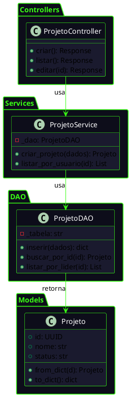
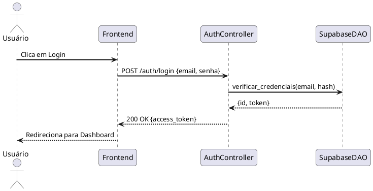
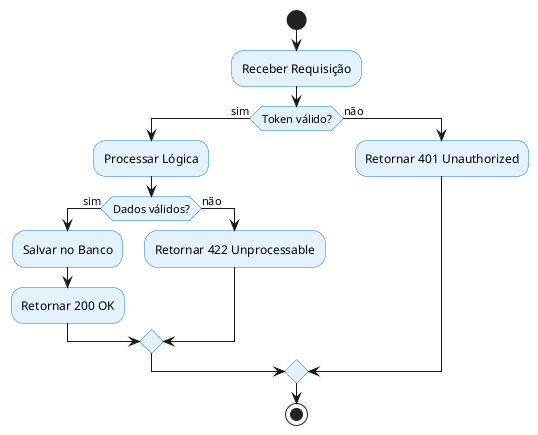
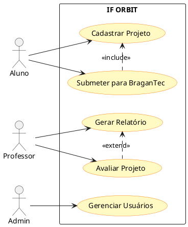
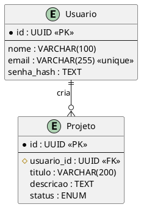
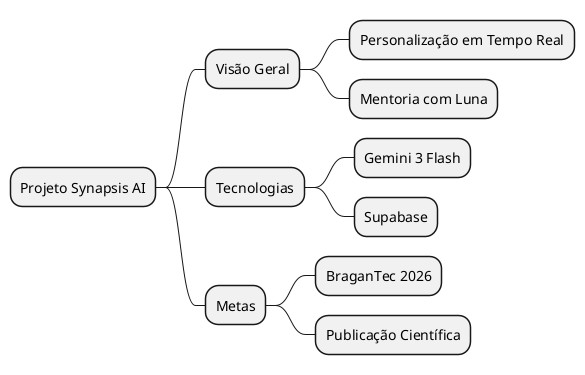
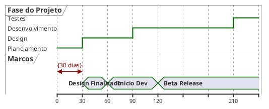

# UML Diagrams — Guia de Geração PlantUML

## Tipos Suportados

| Tipo | Parâmetro `tipo` | Quando usar |
|------|-----------------|-------------|
| Diagrama de Classe | `classe` | Estrutura OOP, herança, atributos, métodos |
| Diagrama de Sequência | `sequencia` | Interações entre objetos ao longo do tempo |
| Diagrama de Atividade | `atividade` | Fluxos de processo, decisões, paralelismo |
| Diagrama de Casos de Uso | `caso_de_uso` | Atores, funcionalidades, relacionamentos |
| Diagrama ER (Banco de Dados) | `er` | Modelagem de dados, tabelas, PK/FK, cardinalidade |
| Mapa Mental | `mindmap` | Organização de ideias, brainstorming, hierarquias |
| Timeline (Linha do Tempo) | `timeline` | Eventos cronológicos, fases de projeto |

---

## Diagrama de Classe

### ⚠️ REGRA CRÍTICA OBRIGATÓRIA: Divisão em Camadas (Packages)

Quando o diagrama envolver classes de diferentes camadas da aplicação (ex: Controllers, Services, DAOs, Models), você **DEVE OBRIGATORIAMENTE** agrupar as classes em pacotes (`package`) correspondentes a essas pastas/camadas. **Nunca** desenhe classes de camadas distintas misturadas sem a devida divisão em packages.

#### Exemplo de Estrutura em Camadas:



**Prefixos de visibilidade:** `-` privado, `+` público, `#` protegido

**Relações:**
- `-->` associação simples
- `*--` composição (tem-um forte)
- `o--` agregação (tem-um fraco)
- `<|--` herança (é-um)

**Quando usar packages:**
- ✅ SEMPRE que houver múltiplas camadas (Controller/Service/DAO/Model)
- ✅ SEMPRE que houver módulos distintos (ex: Auth, Projeto, Chat)
- ❌ Não use em diagramas de apenas 2–3 classes simples sem camadas
- ❌ Não use em diagramas de sequencia

---

## Diagrama de Sequência



**Regras:**
- `actor` para humanos, `participant` para sistemas/serviços
- `->` síncrono, `-->` resposta / assíncrono
- Use `alt`/`else`/`end` para blocos condicionais

---

## Diagrama de Atividade



**Regras:**
- `start` / `stop` obrigatórios
- `:Ação;` — ponto e vírgula obrigatório no final
- `if (condição?) then (sim)` / `else (não)` / `endif`
- `fork` / `fork again` / `end fork` para fluxos paralelos

---

## Diagrama de Casos de Uso



---

## Diagrama ER (Entidade-Relacionamento)



**Cardinalidade:**
- `||--||` (Exatamente um)
- `||--o{` (Um para zero ou muitos)
- `||--|{` (Um para um ou muitos)

---

## Mapa Mental (Mindmap)



---

## Timeline (Linha do Tempo)



---

## Padronização e Estilo

Sempre use este bloco de configuração inicial em diagramas complexos para garantir clareza:

```plantuml
skinparam linetype ortho
skinparam nodesep 60
skinparam ranksep 60
skinparam shadowing false
skinparam roundcorner 5

<style>
  diagramType {
    element {
      BackgroundColor #FFFFFF
      BorderColor #333333
      FontColor #333333
    }
  }
</style>
```

**Mudança de Direção (Setas Ocultas):**
Se você quiser forçar uma classe a ficar do lado da outra (horizontalmente) em vez de embaixo, você pode usar -left->, -right->, -up-> ou -down-> nos relacionamentos (ex: A -right-> B). Isso ajuda a moldar a "grade" do seu diagrama

**Regras:**
- `rectangle "Sistema" {}` delimita o sistema
- `-->` ator usa caso de uso
- `.>` com `<<include>>` (obrigatório) ou `<<extend>>` (opcional)

---

## Boas Práticas

- **Sempre use `package` quando houver camadas arquiteturais** (Controller, Service, DAO, Model, etc.)
- Sempre inclua `skinparam` para visual profissional
- Use sempre `skinparam linetype polyline`, `skinparam nodesep 50` e `skinparam ranksep 50` para que o diagrama fique com linhas retas e organizado.
- Nomes em português para elementos do domínio
- Máximo de 15-20 elementos por diagrama (legibilidade)
- Prefira diagramas focados a diagramas "completos demais"
- Após gerar, explique as principais relações ao usuário
